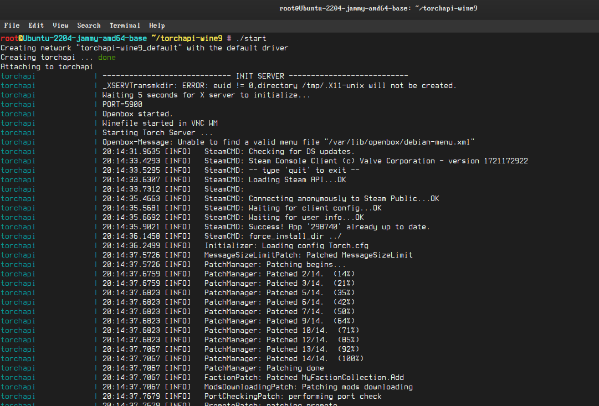

## Space Engineers Torch Server on a Linux Debian Docker with Wine 9
---

 

This is a Docker image you can build yourself from Debian slim docker.
It will launch Space Engineers Torch Server, and you can interact with it
through a passworded VNC server, or through Command Line Interface
(CLI).

This was created by combining previous work done by very smart people.

This version combines soyasoya5's TorchAPI on Linux Docker and
Devidian's work on streamlining and updating the old Dockers.

### Changes from soyasoya5's TorchAPI Docker
---
 - Wine 9 instead of Wine 6
 - More control over Docker build (Debian slim, instead of mmmaxwwwell's Docker image)
 - Automatic Torch startup.
 - VNC access is secured with a password.
 - Implemented some of x10an14's suggestions (https://github.com/soyasoya5/se-torchapi-linux/pull/4)

## Requirements
---
- Docker
- docker-compose
- unzip
- wget
- Any VNC viewer (vncviewer for Linux / MobaXTerm for Windows)

## Configuration
---
You should edit the entrypoint.sh file and find this line;

`runuser -u wine -- bash -c 'x11vnc -display WAIT:99 -forever
-autoport 5900 -auth /app/.Xauthority -passwd mypassword -o
/app/x11vnc.log -bg &'`

Change -passwd `mypassword` to a password that you wish to use
instead.  This should be done BEFORE you build the docker, as this
file will be built into the docker image and cannot be changed later.

## Usage
---
1. Clone this repo
2. Run `./start`

First run will build the docker on your system, please be patient.
After it is complete, you should see this;

You can Ctrl-C break out of the start script after it's loaded Torch, and it will
continue running in the background.  You can access the VNC server as
well.  It will place the server and instances into /torch-server/xxxxx.
You can configure the server and instance after first run, but ideally ./stop
it first.

To connect through VNC, point your client at `your.server.ip.address:5900` and it
should prompt you for your password.

As well as the torch server, there is also a file manager instance
that is launched alongside it, for your use to manage files.

3. Run `./stop`

This will kill and unload all docker processes.  You shouldn't
configure the server until after you have made sure all processes are
stopped and unloaded from memory.

## Notes
---
- As the Torch-API download site appears to be down at the moment, I
have hosted the most recent Torch Server zip file on this repository.
So, this docker will work without requiring downloading of Torch at
the moment.
- This works on headless servers, as you can interface it through SSH
alone.
- Attach a CLI session to the Docker by running this command: `docker exec -it se-torchapi /bin/bash`

## Credits & Acknowledgements
---
- [iamtakingiteasy](https://github.com/iamtakingiteasy/se-torchapi-ds-docker)
- [mmmaxwwwell](https://github.com/mmmaxwwwell)
- [jeppevinkel](https://github.com/jeppevinkel)
- [soyasoya5](github.com/soyasoya5/se-torchapi-linux)
- [Devidian](https://github.com/Devidian/docker-spaceengineers)
